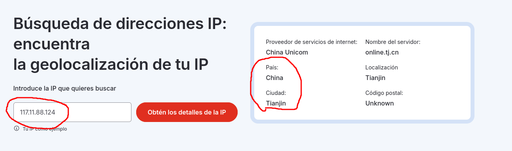

## Caso Web Strike

>En el servidor web de una empresa se detectó un archivo sospechoso, lo que activó las alarmas en la intranet. Se sospecha de una posible actividad maliciosa. El equipo de redes hizo una captura del trafico de red y preparo un archivo PCAP para revisarlo.
>
>La tarea consiste en analizar el Archivo PCAP para descubrir como aparecio el archivo y determinar el alcance de cualquier actividad no autorizada.

### Q1/ Desde qué ciudad se origina el ataque? 

>Primero detectamos el IP del atacante viendo la cantidad de paquetes que le está mandando a la IP de la empresa.

 

>Ahora busco la IP en una página que me de la dirección donde está ubicada.

>Como vemos la IP se encuentra en China, específicamente en Tianjin

### Q2/ Cuál es el agente del usuario completo?

>En uno de los paquetes que el atacante envió específicamente uno con protocolo HTTP nos da información sobre el user-agent.
>

### Q3/ Cual es el nombre del shell web malicioso que se cargó correctamente?

>Después de navegar por el sitio web, el atacante encontró la página de carga y utilizo el método POST para cargar un shell inverso php en el servidor. Para encontrarlo usé el comando http.request.method == POST y follow http.

### Q4/ Que directorio usa el sitio web para almacenar los archivos subidos?

>En el paquete donde queda el registro de la subida de la imagen le hacemos un follow HTTP y en este encontraremos donde se guardó la imagen que subió el atacante.

### Q5/ Qué puerto, abierto en la máquina del atacante, fue el objetivo del shell web malicioso para establecer una comunicación saliente no autorizada?

>Vemos que el puerto que usó el atacante para recibir informacion fue el **8080**.

### Q6/ Qué archivo intentaba sustraer el atacante?

>Analizando uno de los paquetes nos damos cuenta que el objetivo del atacante era el archivo **passwd**.

Siguiente Write-up: [[Lab_2 Oski]]