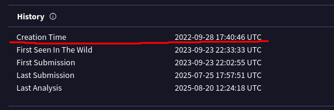
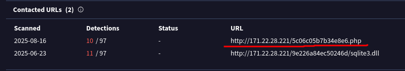
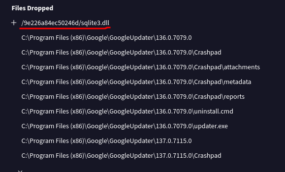
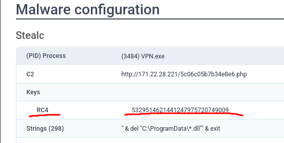
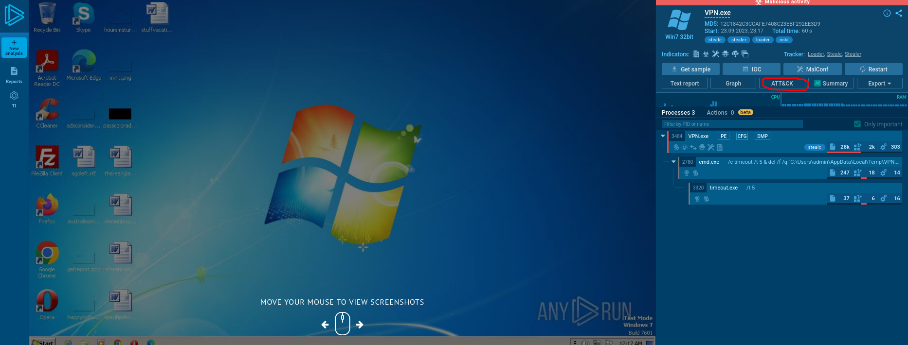
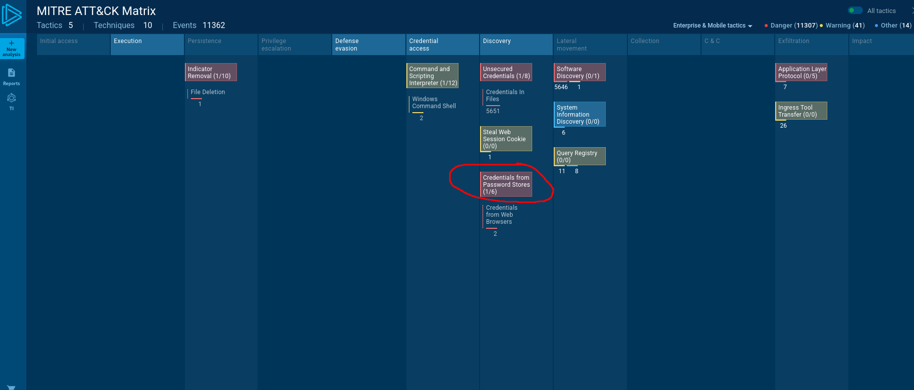
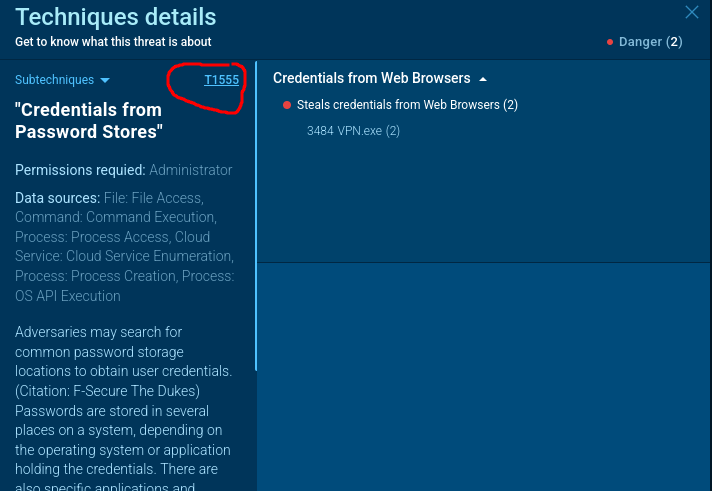
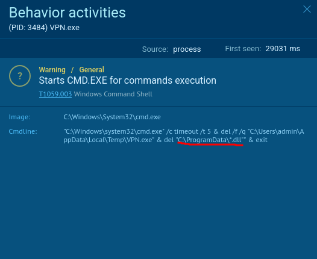
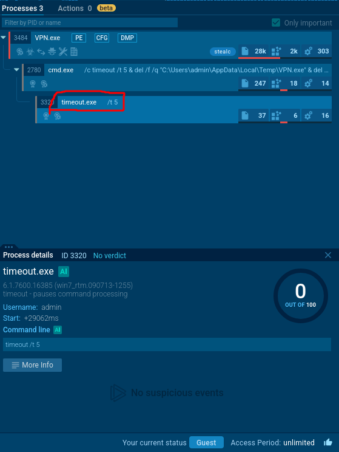
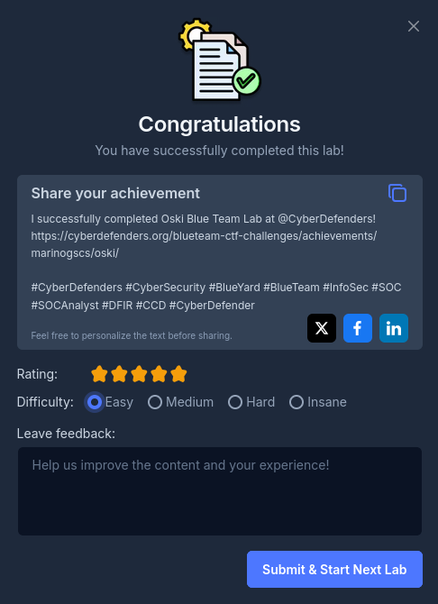

## Caso Oski Lab

>El contable de una empresa recibió un correo electrónico titulado "Nuevo pedido urgente" de un cliente a última hora de la tarde. Cuando intentó acceder a la factura adjunta, descubrió que contenía información falsa sobre el pedido.
>
Posteriormente, la solución SIEM generó una alerta sobre la descarga de un archivo potencialmente malicioso. Tras una investigación inicial, se descubrió que el archivo PPT podría ser el responsable de esta descarga. Haz un examen detallado del archivo.

### Q1/ Determinar la fecha de creación del malware puede proporcionar información sobre su origen. ¿Cuándo se creó el malware?

>Para encontrar la fecha de la creacion del malware usaré una de las herramientas mas importantes en ciberseguridad como lo es **"Virustotal.com".
>
>Cuando ingresamos el hash que se nos proporcionó y lo busquemos en **¨Virustotal.com"** encontramos la creación de éste en el apartado de details y history.

### Q2/ Identificar el servidor de comando y control (C2) con el que se comunica el malware puede ayudar a rastrear al atacante. ¿Con qué servidor C2 se comunica el malware del archivo PPT?

>Como sabemos un C2 o servidor de comando y control se usa para que el atacante controle remotamente la máquina victima, para encontrarlo buscamos el apartado Relations en **"Virustotal.com"** y Bajamos hasta la parte que dice Contacted URls y ahí encontramos el servidor C2 en el que se comunica el malware.

### Q3/ Identificar las acciones iniciales del malware tras la infección puede proporcionar información sobre sus objetivos principales. ¿Cuál es la primera biblioteca que solicita el malware tras la infección?

>Para encontrar la primera biblioteca solicitada por el malware accedemos al apartado Behavior de **"Virutotal.com"** y bajamos hasta la parte que dice "Files dropped¨.

>Una vez ahí nos damos cuenta que el primer archivo que solicitó el malware fue **sqlite3.dll**, esto puede ser para robar datos a traves de SQL o para exfiltración de cookies y credenciales.

### Q4/ Al examinar el informe proporcionado por Any.run, ¿qué clave RC4 utiliza el malware para descifrar su cadena codificada en base64?

>Ahora para encotrar la clave RC4 usaré una herramienta llamada **ANY.RUN**. Una vez que coloquemos el hash y estemos en el reporte de él, bajamos hasta la parte que dice Malware configuration donde encontramos la clave **RC4**.

### Q5/ Al examinar las técnicas MITRE ATT&CK que aparecen en el informe del entorno de pruebas Any.run, identifique la técnica MITRE principal (no las subtécnicas) que utiliza el malware para robar la contraseña del usuario.

>Para resolver esta pregunta uso nuevamente la herramienta Any.run,
>ahora accediendo a la parte ATT&CK.

>luego de acceder al apartado ATT&CK no saldrá una nueva ventana llamada **MITRE ATT&CK Matrix** donde daremos click en **Credentials from Password Stores (1/6)**.

Una vez ahí nos saldrá el nombre de la técnica MITRE ATT&CK usada para robar la contraseña del usuario.

Como vemos la tecnica usada fue **T1555**.

### Q6/ Al examinar los procesos secundarios que aparecen en el informe del entorno aislado Any.run, ¿qué directorio es el objetivo del malware para eliminar todos los archivos DLL?

>Después del atacante robar las credenciales y acceder al sistema como admin ejecuta unos comandos en cmd uno de ellos nos revela el directorio objetivo a eliminar.

>Cuando revisamos el proceso logramos ver que el comando ejecuta un del C:\ProgramData\*.dll lo que hace que el sistema elimine los archivos .dll

### Q7/ Comprender el comportamiento del malware tras la exfiltración de datos puede proporcionar información sobre sus técnicas de evasión. Al analizar los procesos secundarios, tras exfiltrar con éxito los datos del usuario, ¿cuántos segundos tarda el malware en autodestruirse?

>Para saber cuanto tardó el malware en autodestruirse debemos acceder a la parte llamada **timeout** en la pagina de any.run donde estamos analizando el malware.

>Justo ahí al lado de timeout.exe vemos t5 lo que significa que el malware tardó en destruirse en 5 segundos

Siguiente Write-up: [[Lab_3 PoisonedCredentials]]