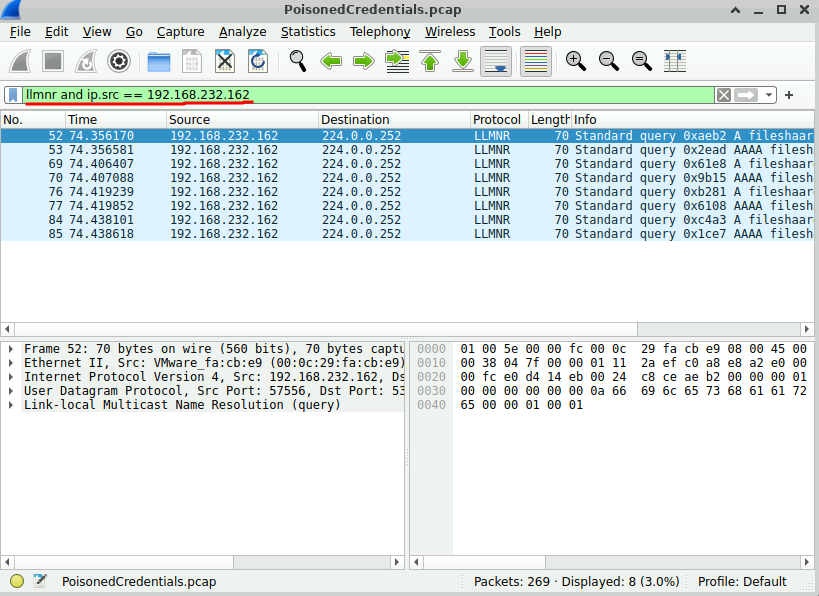
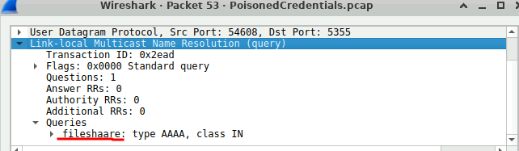
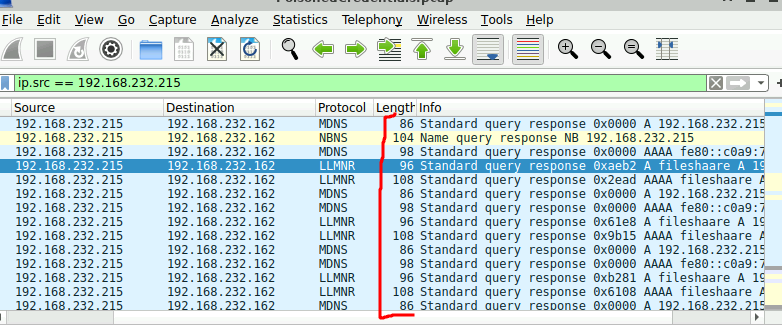
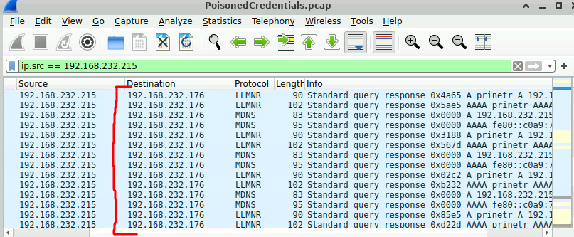
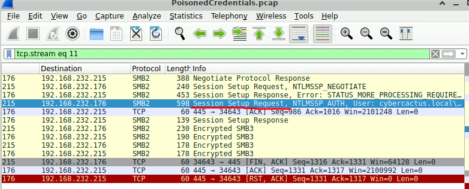
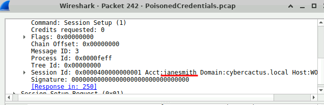
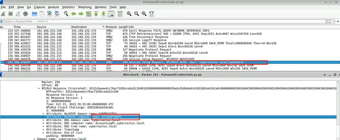

## Caso PoisonedCredentials

>El equipo de seguridad de su organización a detectado un aumento en la actividad sospechosa de la red. Existe la preocupación de que se estén produciendo ataques de envenenamiento LLMNR (Link-Local Multicast Name Resolution) y NBT-NS (NetBIOS Name Service) dentro de su red. Estos ataques son conocidos por aprovechar estos protocolos para interceptar el tráfico  de red y comprometer potencialmente las credenciales de los ususarios. Su tareas consiste en investigar los registros de red y examinar el tráfico de red capturado.

### Q1/ En el contexto del incidente descrito en el escenario, el atacante inició sus acciones aprovechando el tráfico de red benigno de máquinas legítimas. ¿Puede identificar la consulta mal escrita específica realizada por la máquina con la dirección IP 192.168.232.162?

>Primero abrimos el archivo .PCAP con la herramienta WireShark y una vez ahí realizamos la busqueda **llmnr and ip.src == 192.168.232.162** 

>Una vez hecha la búsqueda miramos entre los archivos alguna busqueda mal escrita y revisando las queries encontramos que hay escrito **fileshaare** en vez de fileshare, entonces esa sería la respuesta a nuestra primera pregunta.

### Q2/ Estamos investigando un incidente de seguridad en la red. Para llevar a cabo una investigación exhaustiva, necesitamos determinar la dirección IP del equipo malicioso. ¿Cuál es la dirección IP del equipo que actúa como entidad maliciosa?

>Buscamos alguna IP con comportamientos raros y vemos que la IP 192.168.232.215 pese a no ser un servidor DNS respondió a multiples consultas de resolución.

### Q3/ Como parte de nuestra investigación, es esencial identificar todas las máquinas afectadas. ¿Cuál es la dirección IP de la segunda máquina que recibió respuestas maliciosas de la máquina maliciosa?

>Como ya vimos una de las máquinas atacadas fue la **192.168.232.215** y para encontrar la otra debemos ver a que otra IP respondió el atacante, y nos damos cuenta que fue **192.168.232.176**

### Q4/ Sospechamos que las cuentas de usuario pueden haber sido comprometidas. Para evaluar esto, debemos determinar el nombre de usuario asociado con la cuenta comprometida. ¿Cuál es el nombre de usuario de la cuenta que el atacante comprometió?

>Para ver el usuario que comprometió el atacante buscamos en alguno de los paquetes que sea un intento de inicio de sesión.

>Luego revisamos el paquete y en la parte de **SMB2 header** encontramos que el usuario comprometido fue el de **janesmith**

### Q5/ Como parte de nuestra investigación, nuestro objetivo es comprender el alcance de las actividades del atacante. ¿Cuál es el nombre de host de la máquina a la que accedió el atacante a través de SMB?

>Accedemos al paquete de inicio de sesión o Session Setup Request y en la parte NTLMv2 encontramos el nombre del host de la máquina a la que accedió el atacante a través de SMB que es ACCOUNTINGPC

Siguiente Write-up: [[Lab_4 Yellow Rat]]