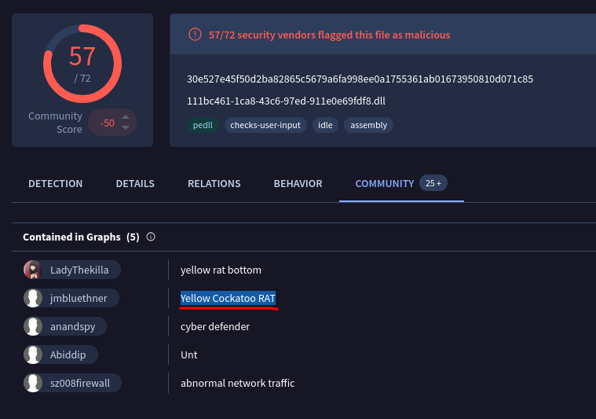
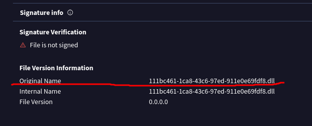
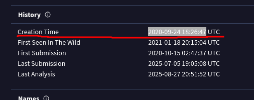
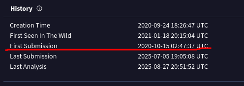
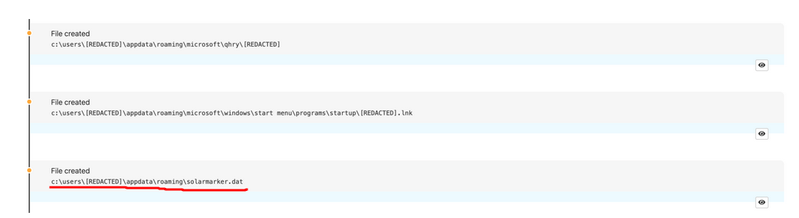
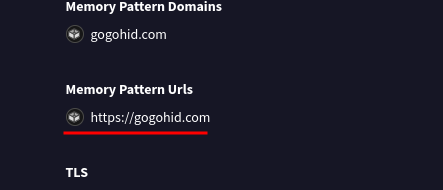
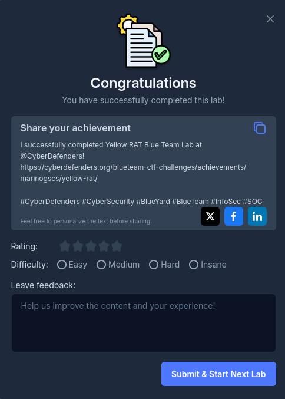

## Caso Yellow Rat

>Durante una comprobación periódica de seguridad informática en GlobalTech Industries, se detectó un tráfico de red anormal
>procedente de varias estaciones de trabajo. Tras una investigación inicial, se descubrió que las consultas de búsqueda de ciertos empleados estaban siendo redirigidas a sitios web desconocidos. Este descubrimiento suscitó preocupación y motivó una investigación más exhaustiva. Su tarea consiste en investigar este incidente y recopilar toda la información posible.

### Q1/ Comprender al adversario ayuda a defenderse de los ataques. ¿Cómo se llama la familia de malware que provoca tráfico de red anormal?

>Para encontrar la respuesta a esta pregunta, uso la herramienta Virustotal, con la que podemos ver en la sección de comunidad como se llama la familia del malware.

### Q2/ Como parte de nuestra respuesta ante incidentes, conocer los nombres de archivo comunes que utiliza el malware puede ayudar a analizar otras estaciones de trabajo en busca de posibles infecciones. ¿Cuál es el nombre de archivo común asociado al malware descubierto en nuestras estaciones de trabajo?

>El nombre del archivo lo encontraremos en el apartado de detalles de VirusTotal, y buscamos la zona en la que dice signature verification en esa misma parte hay algo llamado original name, ahí estará la respuesta.

### Q3/ Determinar la marca de tiempo de compilación del malware puede revelar información sobre su desarrollo y su cronología de implementación. ¿Cuál es la marca de tiempo de compilación del malware que infectó nuestra red?

>El tiempo de creación de los archivos lo encontramos en el mismo lugar en que encontramos la respuesta anterior, el apartado de detalles, pero esta vez buscamos la parte donde dice History y ahí mismo Creation Time.

### Q4/ Saber cuándo la comunidad de ciberseguridad en general identificó por primera vez el malware podría ayudar a determinar cuánto tiempo pudo haber estado presente en el entorno antes de ser detectado. ¿Cuándo se envió por primera vez el malware a VirusTotal?

>Para encontrar cuando fue visto por primera vez este malware debemos estar en el apartado de detalles, en la parte en que antes estuvimos, llamada history, ahí encontraremos first submission donde estará nuestra respuesta.

### Q5/ Para erradicar por completo la amenaza de los sistemas de Industries, necesitamos identificar todos los componentes que ha instalado el malware. ¿Cuál es el nombre del archivo .dat que el malware ha instalado en la carpeta AppData?

>Para saber que archivo .dat se instala necesitamos buscar el malware de Yellow Cockatoo en internet y en la página de redcanary se nos proporciona la información que necesitamos.

### Q6/ Es fundamental identificar los servidores C2 con los que se comunica el malware para bloquear su comunicación y evitar una mayor filtración de datos. ¿Cuál es el servidor C2 con el que se comunica el malware?

>Para encontrar el servidor C2 con el que se comunica el malware debemos ir al apartado de behavior y bajamos hasta donde dice memory pattern Urls.

Siguiente Write-up: [[Lab_5 Lespion]]