## Caso Lespion

>Un cliente cuya red ha sido comprometida y desconectada le ha encargado investigar el incidente y determinar la identidad del atacante.
>Los responsables de la respuesta ante incidentes y los investigadores forenses digitales se encuentran actualmente en el lugar y han llevado a cabo una investigación preliminar. Sus conclusiones indican que el ataque se originó en una sola cuenta de usuario, probablemente de alguien interno. Investigue el incidente, encuentre el responsable interno y descubrta las acciones del ataque.

### Q1/ Archivo -> Github.txt: ¿Qué clave API añadió el informante a sus repositorios de GitHub?

>Para encontrar la clave API del informate primero debemos acceder a su github, que nos proporcionan su link en los archivos de la investigación, una vez ahí abrimos el repositorio Project-Built---Custom-Login-page, y dentro de este está el archivo Login Page.js donde encontraremos de primero la API Key.

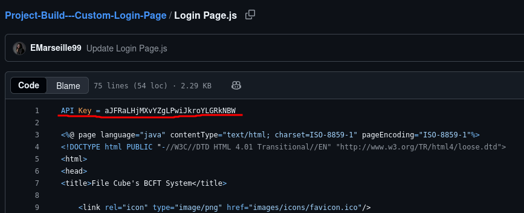

### Q2/ Archivo -> Github.txt: ¿Qué contraseña en texto plano añadió el empleado a sus repositorios de GitHub?

>Para encontrar la contraseña debemos estar ubicados en el archivo Page.js ubicado Project-Built---Custom-Login-page.

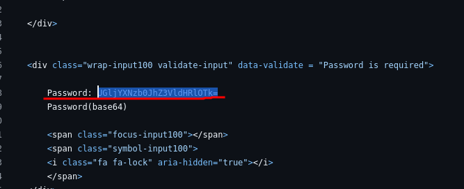

>Pero como vemos hay un problema la contraseña no está en texto plano sino que está codificada en Base64 por lo que vamos a usar la herramienta CyberChef para que nos ayude en decodificar y conseguir el texto plano de la contraseña.

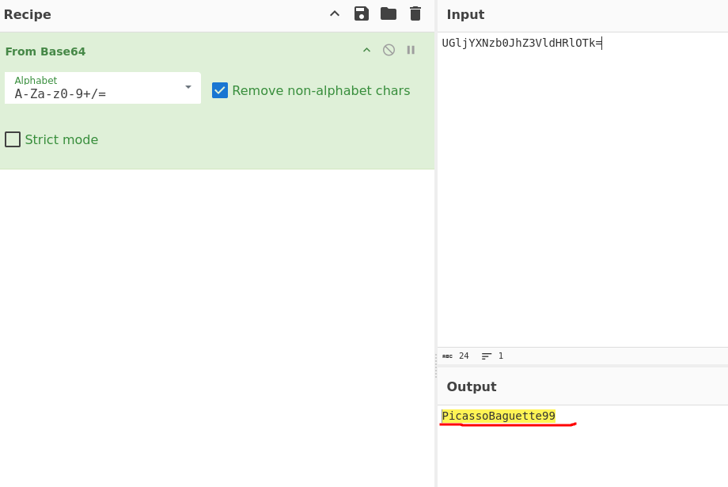

### Q3/ Archivo -> Github.txt: ¿Qué herramienta de minería de criptomonedas utilizó el informante?

>Revisando en sus repositorios de github encontramos algo llamado xmrig y viendolo más a detalle nos damos cuenta de que se trata de una herramienta de minado de criptos.

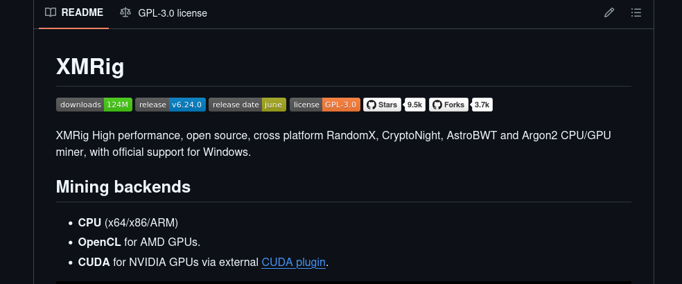

### Q4/ ¿En qué sitio web de juegos tenía una cuenta el informante?

>Para saber el sitio web de video juegos donde tiene su cuenta buscamos en internet con su mismo nombre de usuario en GitHub, al hacer eso nos damos cuenta que el sitio web es Steam.

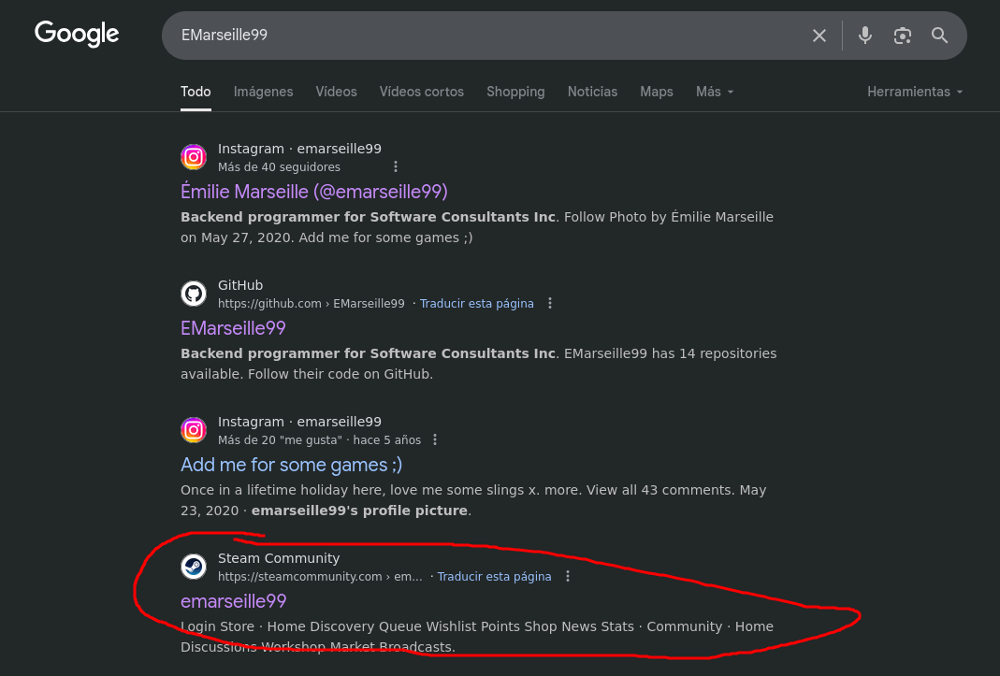

### Q5/ ¿Cuál es el enlace al perfil de Instagram de la persona con información privilegiada?

>Para encontrar el link de su Instagram seguimos la misma estrategia que en la pregunta anterior, donde buscamos su nombre de usuario en internet y el primer link que sale es el de su perfil de instagram.

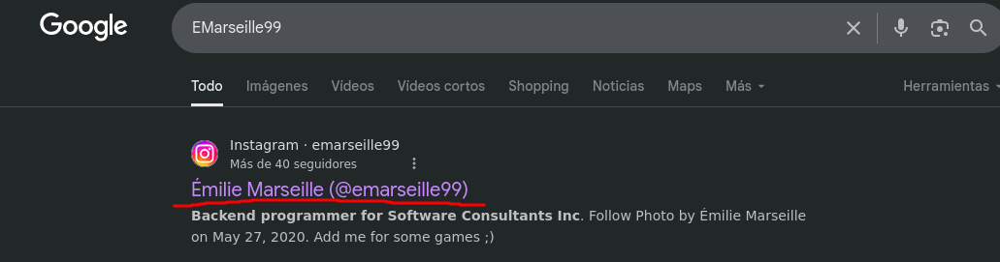

### Q6/ ¿Qué país visitó la persona con información privilegiada durante sus vacaciones?

>Para saber en lugar de vacaciones de la persona le tomé screen shot a una de las fotos que hizo durante éstas, para luego buscar en google imagenes donde queda ese lugar y descubrir que es en Singapore.

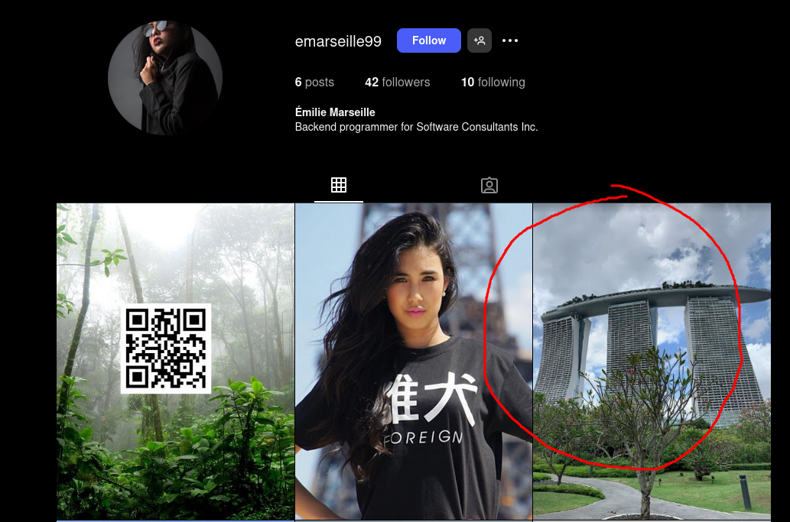

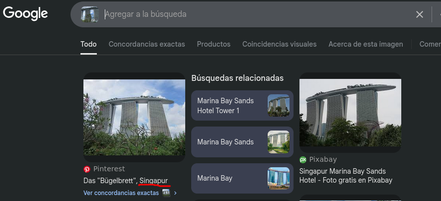

### Q7/ ¿En qué ciudad vive la familia del informante?

>Para saber donde vive su familia, nos guiamos de otra foto en su instagram en esta publicación se puede ver de fondo el Burj Khalifa que queda ubicado en la ciudad de Dubai.

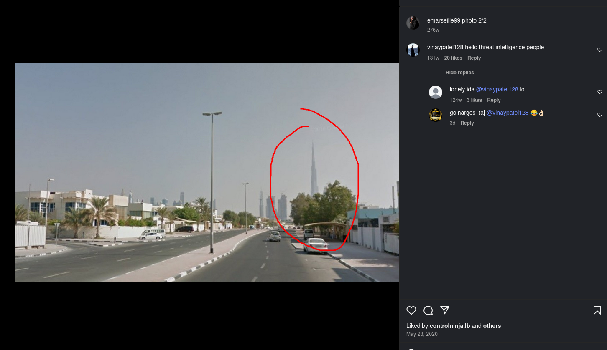

### Q8/ Archivo -> oficina.jpg: Se le ha proporcionado una imagen del edificio en el que la empresa tiene su oficina. ¿En qué ciudad se encuentra la empresa?

>Para encontrar la ciudad de la empresa donde trabaja usamos la foto oficina.jpg en la cual se puede ver Alexandra theatre el cual al hacer una búsqueda nos damos cuenta que está ubicado en la ciudad de Birmingham, Inglaterra.

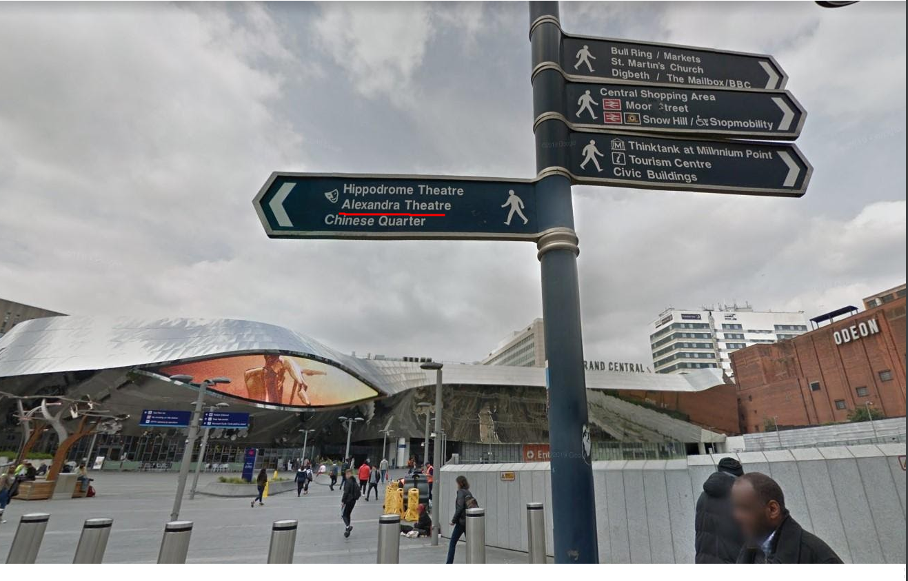

### Q9/ Archivo -> Webcam.png: Con la información que nos has proporcionado, nuestra unidad de vigilancia terrestre está vigilando la dirección sospechosa de la persona de interés. La vieron salir de su apartamento y la siguieron hasta el aeropuerto. Su avión despegó y aterrizó en otro país. Nuestro equipo de inteligencia localizó al objetivo con esta cámara IP. ¿En qué estado se encuentra esta cámara?

>Para saber cual es el lugar que está en la imagen de la cámara IP que nos pasó el equipo de inteligencia usamos la búsqueda por imagen al hacerlo nos damos cuenta que el lugar es la universidad de Notre Dame la cual se encuentra ubicada en el estado de Indiana.

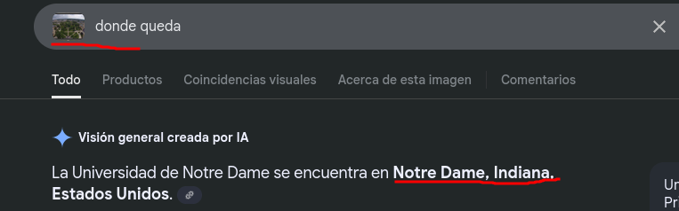

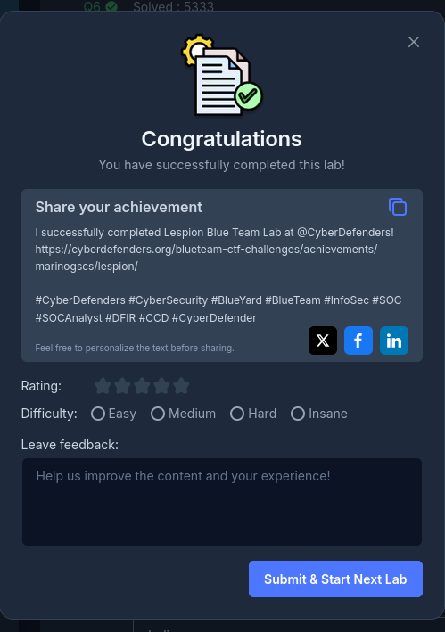