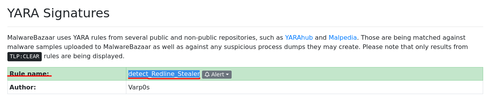

## Caso Red Stealer

>Formas parte del equipo de Inteligencia de Amenazas del SOC (Centro de Operaciones de Seguridad). Se ha descubierto un archivo ejecutable en el ordenador de un compañero y se sospecha que está vinculado a un servidor de comando y control (C2), lo que indica una posible infección por malware.
Tu tarea consiste en investigar este archivo ejecutable analizando su hash. El objetivo es recopilar y analizar datos que sean útiles para otros miembros del SOC, incluido el equipo de respuesta a incidentes, con el fin de responder de manera 
eficiente a este comportamiento sospechoso.

### Q1/ Clasificar el malware permite comprender de forma más rápida y clara sus comportamientos únicos y sus vectores de ataque. ¿Qué categoría ha identificado Microsoft para ese malware en VirusTotal?

>Para poder hacer seguimiento del hash del virus usamos la herramienta virustotal, una vez ahí al haber ingresado el hash en la búsqueda podemos encontrar en la parte de behavior los diferentes reportes hechos en sandbox entre los cuales se encuentra el de Microsoft el cual nos indica que el tipo de malware es Trojano.

### Q2/ Identificar claramente el nombre del archivo malicioso mejora la comunicación entre el equipo del SOC. ¿Cuál es el nombre del archivo asociado a este malware?

>En el apartado de detalles de virustotal podemos encontrar información de su nombre específicamente en **File Version Information** donde vemos que es **WEXTRACT**.

### Q3/ Conocer la fecha y hora exactas en que se detectó por primera vez el malware puede ayudar a priorizar las medidas de respuesta. El malware recién detectado puede requerir una contención y erradicación urgentes en comparación con amenazas más antiguas y bien documentadas. ¿Cuál es la fecha y hora UTC de la primera presentación del malware en VirusTotal?

>Para encontrar la fecha en la que el malware se registró por primera vez en virustotal debemos estar en el mismo apartado de detalles de la pregunta anterior, solo que ahora vamos hasta el lugar que dice **History** donde veremos **First Submission 2023-10-06 04:41:50 UTC** que es la fecha exacta.

### Q4/ Comprender las técnicas utilizadas por el malware ayuda a planificar la seguridad de forma estratégica. ¿Cuál es el ID de la técnica MITRE ATT&CK para la recopilación de datos del malware del sistema antes de la exfiltración?

>Para saber que técnica de MITRE ATT&CK se usa para la recopilación de datos en un sistema, buscamos en la página oficial del framework, donde vemos en la parte de collection una técnica llamada **Data from local system** que se identifica con el **T1005**.

### Q5/ Tras la ejecución, ¿qué nombres de dominio relacionados con las redes sociales resolvió el malware mediante consultas DNS?

>Para encontrar la resolución DNS relacionada con alguna red social usamos nuevamente virustotal, esta vez nos vamos al apartado de behavior donde tenemos que bajar hasta DNS resolutions, ahí veremos que la red social que resolvió el malware durante las consultas fue **facebook.com**.

### Q6/ Una vez identificadas las direcciones IP maliciosas, se pueden configurar dispositivos de seguridad de red, como cortafuegos, para bloquear el tráfico hacia y desde estas direcciones. ¿Puede proporcionar la dirección IP y el puerto de destino con los que se comunica el malware?

>En virustotal, en el mismo apartado de behavior bajamos hasta la parte que dice **IP traffic**, en esta encontraremos el IP y el puerto con el que se comunica el malware.

### Q7/ Las reglas YARA están diseñadas para identificar patrones y comportamientos específicos de malware. Utilizando MalwareBazaar, ¿cuál es el nombre de la regla YARA creada por «Varp0s» que detecta el malware identificado?

>Para encontrar la regla YARA creada por Varp0s usaremos la herramienta **MalwareBazaar** donde encontramos que se llama **detect_Redline_Stealer**.

### Q8/ Comprender qué familias de malware están atacando a la organización ayuda a planificar estratégicamente la seguridad para el futuro y a priorizar los recursos en función de la amenaza. ¿Puede proporcionar los diferentes alias de malware asociados a la dirección IP maliciosa según ThreatFox?

>Para encontrar el alias del malware debemos entrar a threatfox y buscar por medio del IP de la pregunta 6, una vez hecho eso encontramos la información y vemos que el alias es **RECORDSTEALER**.

### Q9/ Al identificar las DLL importadas por el malware, podemos configurar las herramientas de seguridad para que supervisen la carga o el uso inusual de estas DLL específicas. ¿Puede proporcionar la DLL utilizada por el malware para la escalada de privilegios?

>Para saber que DLL es utilizada para los privilegios usamos nuevamente **virustotal**, esta vez accedemos al apartado de detalles, una vez allí bajamos hasta la parte que dice **imports**, ahí vemos **ADVAPI.dll** que se usa para la escalada de privilegios.

