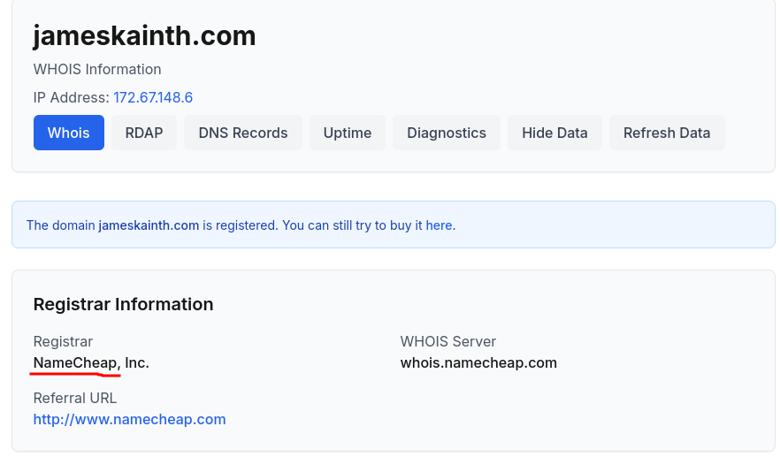
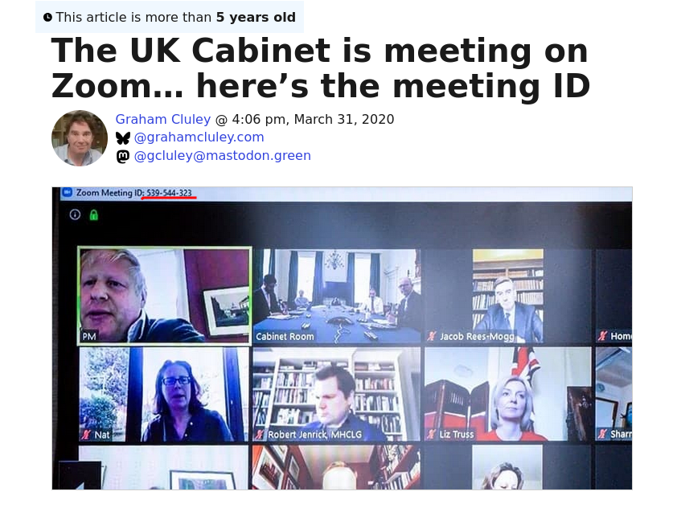
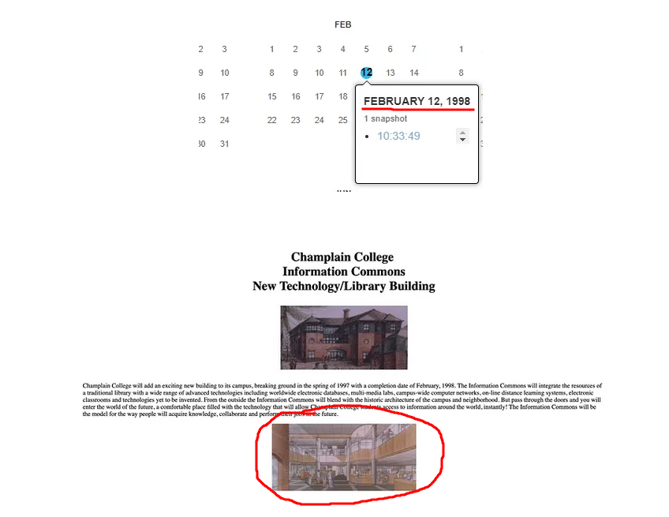
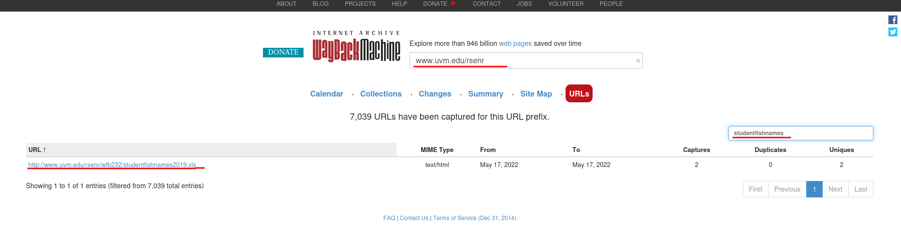
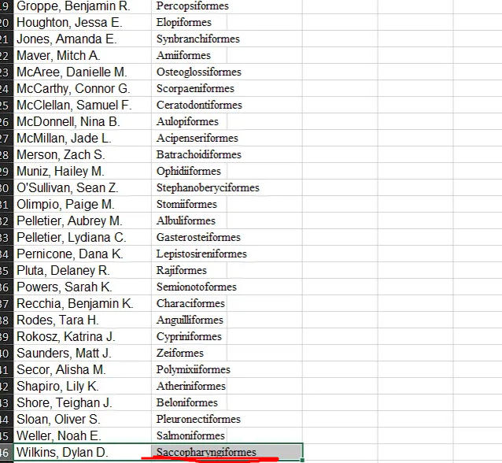
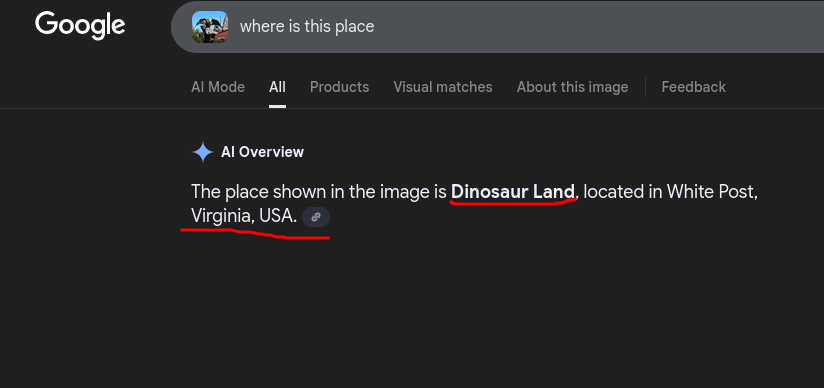
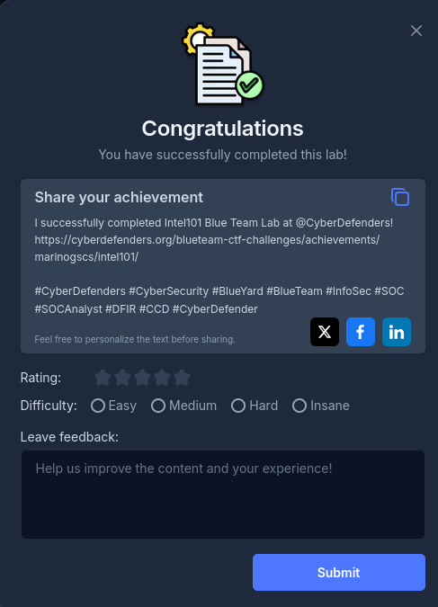

## Caso Intel 101

>Este ejercicio se centra en la inteligencia de fuentes abiertas ([[OSINT]]) como método para extraer y analizar datos disponibles públicamente. Su objetivo es mejorar las habilidades para obtener información valiosa al investigar amenazas externas en el papel de analista del equipo azul de seguridad. A través de la aplicación práctica, los participantes aprenderán a recopilar e interpretar información de manera eficaz para mejorar las medidas de seguridad generales.

### Q1/ ¿Quién es el registrador de jameskainth.com?

>Para resolver esta pregunta haremos uso de la herramienta [[Who is]] que la podemos buscar en el navegador, esta nos da información de direcciones IP o los dominios que introduzcamos, en este caso ponemos **jameskainth.com** que es la página de la cual se nos pide su registrador. Una vez en la página y puesto el dominio de la página web podremos observar que el nombre de del registrador es **NameCheap** 

### Q2/ ¿Cuál es el ID de la reunión de Zoom de la reunión del gabinete del primer ministro británico?

>Para encontrar la respuesta a esta pregunta buscaremos en internet **zoom meeting id of the British Prime Ministers Cabinet Meeting** y saldrán varias noticias donde vemos que el primer misitro britanico filtró sin querer el ID de la reunión que es **539544323**.

### Q3/ En 1998, concretamente el 12 de febrero, Champlain tenía previsto añadir un nuevo y emocionante edificio a su campus. En aquel entonces, se llamaba «The Information Commons». ¿Puedes encontrar una imagen de cómo sería el interior? Envía el [[hash]] [[SHA256]].

>Para encontrar la imagen del edificio del campus por dentro debemos usar una herramienta llamada [[Wayback Machine]] la que nos dará acceso a como era la página el 12 de febrero de 1998 con esta informacion de la página podremos encontrar la imagen, después cuando la tengamos le hacemos un **sha256sum** para que nos la convierta en sha256 lo que nos genera **f4952b314eb15acf0eec79c954f83881c17d50d2b5922ee37e8fc5e5cd1aeac2**

### Q4/ En 2019, la clase de ictiología de la UVM tuvo que poner nombre a sus peces para la clase. ¿Puedes averiguar cómo llamó a su pez la última persona de la lista pública?

>Para poder encontrar el nombre del pez debemos usar nuevamente la herramienta de [[Wayback Machine]] esta vez buscando la página de **UVM** y filtrando la información adecuadamente para encontrar el dominio donde se encuentra el documento con los nombres de los peces y las personas

>Una vez descargado el documento **.xlss** lo abrimos para encontar la última persona de la lista pública.

### Q5/ ¿Puedes identificar el estado desde el que se tomó esta foto? Mira la foto adjunta.

>Para encontrar la ubicación de esta imagen, hacemos un búsqueda por imagen en google, la cual nos dará la ubicación que es en **Virginia**

